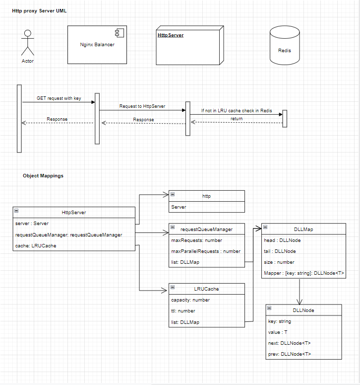
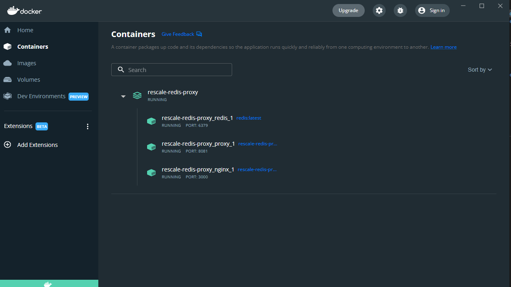

# Problem statement : Build a Redis Proxy

## System Prerequisite :
* make
* docker
* docker-compose
* bash

## What is the Proxy Server doing ? 
* Starts an HttpServer from index.ts
* Listens to the port defined in the .env file
* Process any request with a key e.g. `/:key`
* Request queue manager uses double linked list Map which is essentially made up of doubly linked list node 
* Request queue manager checks cache if the key is present if not present then it checks redis
* Queue will return a 503 if it is full
* The request queue gets tasks based on the maxParallelRequests it can handle 
* return 404 if value not found

## Architectural & UML


## Docker containers running



## How do we run the test ? 
* To run tests use 
  ```sh
  make test
  ```
* Alternatively if you're in the dev environment and have recently pulled the repository
  ```sh
  npm i
  npm run build
  npm run start_local_docker
  npm run test
  ```
* `make fillRedis` - fill redis by values (`key_1`, `key_2`, etc.)
* `make getValuesViaApi key_1 key_2` - get values from redis via api
* `make start` - start proxy on 3000 port (configure store in `.env` file)
* `make stop` - stop proxy


### How long you spent on each part of the project
* Architecture & Design `1 hour`
* LRU Cache `2 hours `
* Message Queue `1 hour`
* HTTP web service `2 hour`
* Redis client `1 hour`
* wsl2 issue not running docker `2 hours` -- blocked me for a bit
* Tests `2 hours`
* Bonus requirement : Parallel concurrent processing `3 hours`
* Makefile, Readme and images `2 hours`